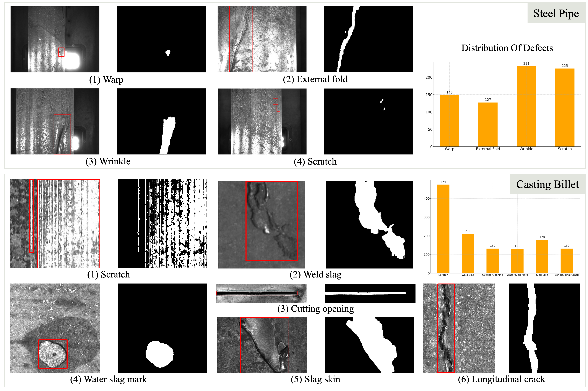

# MVIA_metal_datasets
*Provided by MVIA La.*

## 📌 Overview
We release two metal surface defect datasets with instance-level pixel annotations: Casting Billet, Steel Pipe.

## 🗃️ Datasets
### 1. Casting Billet Dataset
- **Images**: 1,060 (780 defective)
- **Resolution**: 96×106 to 3,228×492
- **Defect Types**:
  - Scratch
  - Weld slag 
  - Cutting opening
  - Water slag mark
  - Slag skin
  - Longitudinal crack

### 2. Steel Pipe Dataset
- **Images**: 1,227 (554 defective) 
- **Resolution**: 728×544 (fixed)
- **Defect Types**:
  - Warp
  - External fold
  - Wrinkle 
  - Scratch

## ✏️ Annotation Process
1. **AI Pre-segmentation**: SAM model with box prompts
2. **Expert Refinement**: Manual correction by experts

## 🖼️ Samples

## 📥 Download
[Download Link](#) | [Alternative Mirror](#)

## 📜 Citation

## 📧 Contact
For dataset inquiries or collaboration opportunities:  
📧 [xuke@ustb.edu.cn](mailto:xuke@ustb.edu.cn)
📧 [chuniliu@xs.ustb.edu.cn](mailto:chuniliu@xs.ustb.edu.cn)
---

**Maintained by** [MVIA Lab](https://cicst.ustb.edu.cn/rcpy/yjsds/bssds1/2d415f8ca1f54cc6abafe9b7c10ba665.htm) @ [Collaborative Innovation Center of Steel Technology](https://cicst.ustb.edu.cn/), [University of Science and Technology Beijing](https://www.ustb.edu.cn)
