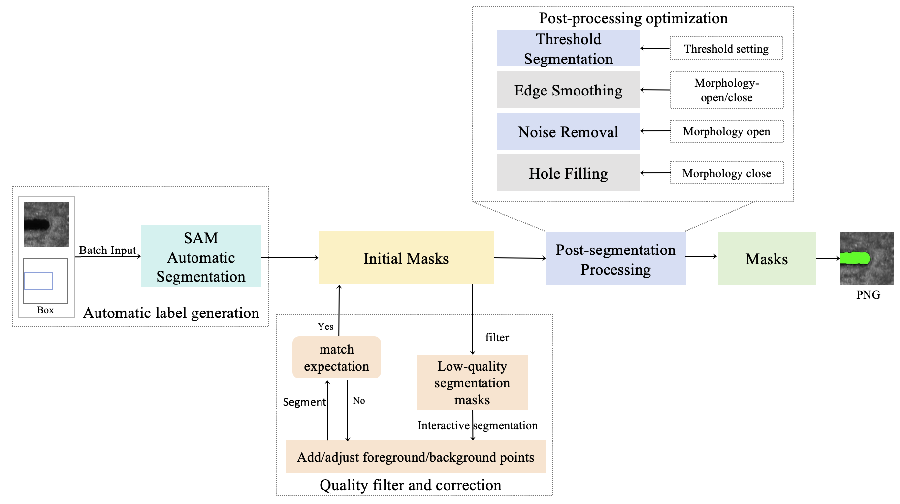

# MVII_metal_datasets
*Provided by Machine Vision and Industrial Inspection Laborator (MVII Lab).*

## 📌 Overview
We release two metal surface defect datasets with instance-level pixel annotations: Casting Billet, Steel Pipe.

## 🗃️ Datasets
### 1. Casting Billet Dataset
- **Images**: 1,060 (780 defective)
- **Resolution**: 96×106 to 3,228×492
- **Defect Types**:
  - Scratch
  - Weld slag 
  - Cutting opening
  - Water slag mark
  - Slag skin
  - Longitudinal crack

### 2. Steel Pipe Dataset
- **Images**: 1,227 (554 defective) 
- **Resolution**: 728×544 (fixed)
- **Defect Types**:
  - Warp
  - External fold
  - Wrinkle 
  - Scratch

## ✏️ Annotation Process

1. **AI Pre-segmentation**  
   Leverage SAM's predictive interface to perform batch automatic segmentation, generating initial masks based on the provided bounding box annotations and images.

2. **Expert Refinement**  
   1. **Identification of Suboptimal Segmentation**:  
      Review the initial masks to identify suboptimal segmentation results through human assessment.

   2. **Interactive Refinement**:  
      For suboptimal results, use SAM's interactive segmentation by iteratively adding:  
      - **Positive sample points** to guide the identification of the target region.  
      - **Negative sample points** to exclude interference regions.  
      Continuously update the segmentation results in real-time until the desired accuracy is achieved.

   3. **Post-processing**:  
      - Perform threshold-based segmentation using optimal thresholds for the specific dataset.  
      - Apply morphological operations, including **opening** and **closing**, to smooth edges, eliminate noise, fill holes, and perform other enhancements.

## 🖼️ Samples

## 📥 Download
[Download Link](https://pan.baidu.com/s/1uYLvkAdRHw3TKjiJIHuO1A?pwd=uk4f)

## 📜 Citation

## 📧 Contact
For dataset inquiries or collaboration opportunities:  📧 [xuke@ustb.edu.cn](mailto:xuke@ustb.edu.cn) 📧 [chuniliu@xs.ustb.edu.cn](mailto:chuniliu@xs.ustb.edu.cn)

---

**Maintained by** [MVII Lab](https://cicst.ustb.edu.cn/rcpy/yjsds/bssds1/2d415f8ca1f54cc6abafe9b7c10ba665.htm) @ [Collaborative Innovation Center of Steel Technology](https://cicst.ustb.edu.cn/), [University of Science and Technology Beijing](https://www.ustb.edu.cn)
